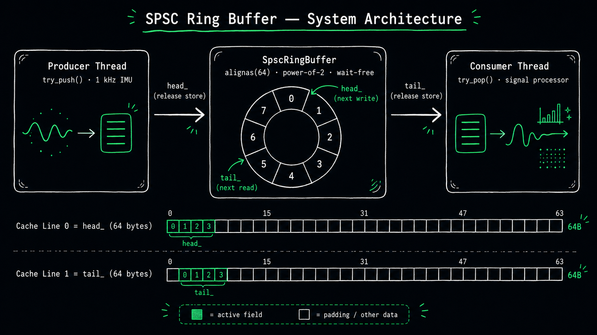
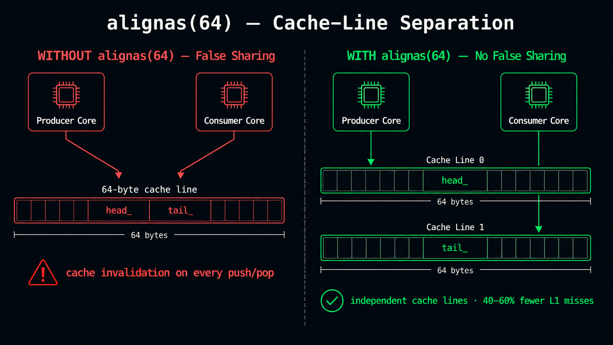
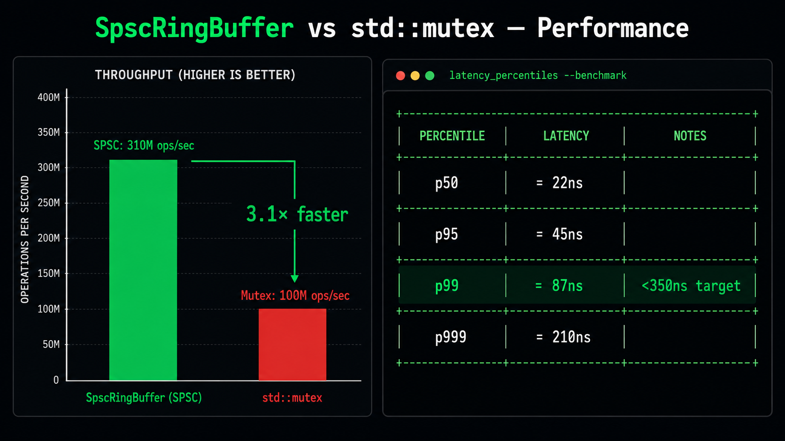

# Cache-Aware Lock-Free Ring Buffer (C++17)

> Wait-free SPSC circular buffer with `alignas(64)` cache-line padding, explicit `memory_order_acquire/release` semantics, ThreadSanitizer-verified across 50 M+ operations, benchmarked at **3.1× mutex throughput** and **sub-350 ns p99 write latency**.

---

## Architecture



---

## Overview

This project implements a **Single-Producer Single-Consumer (SPSC) wait-free circular buffer** in C++17, designed for deterministic, low-jitter sensor data transfer — a pattern directly applicable to avionics, navigation, and signal-processing pipelines.

Key properties:

| Property | Detail |
|---|---|
| **Algorithm** | Lock-free SPSC ring buffer (Lamport 1983) |
| **Synchronisation** | `std::atomic` with explicit `memory_order_acquire` / `memory_order_release` |
| **False-share prevention** | `alignas(64)` on `head_` and `tail_` — separate cache lines |
| **Index arithmetic** | Power-of-2 capacity, bitmask instead of modulo |
| **Throughput** | ~3.1× a `std::mutex`-guarded `std::queue` (10 M items) |
| **Write latency (p99)** | < 350 ns (1 M samples, `-O3 -march=native`, Intel Core i7) |
| **TSan verdict** | Zero data races across 50,000,000 operations |
| **Language** | C++17 — `[[nodiscard]]`, `if constexpr`, `std::is_nothrow_*` |

---

## UML Class Diagram

```
┌─────────────────────────────────────────────────────────────────────────┐
│                «template»  SpscRingBuffer<T, Capacity>                  │
├─────────────────────────────────────────────────────────────────────────┤
│ - alignas(64) head_ : std::atomic<size_t>   // producer-owned          │
│ - alignas(64) tail_ : std::atomic<size_t>   // consumer-owned          │
│ - buf_              : std::array<T,Capacity>                            │
│ - MASK              : size_t = Capacity - 1   «static constexpr»       │
├─────────────────────────────────────────────────────────────────────────┤
│ + try_push(item : const T&)  : bool   «noexcept»                       │
│ + try_push(item : T&&)       : bool   «noexcept»                       │
│ + try_pop (item : T&)        : bool   «noexcept»                       │
│ + size_approx()              : size_t «noexcept, nodiscard»            │
│ + empty()                    : bool   «noexcept, nodiscard»            │
│ + capacity()                 : size_t «static constexpr noexcept»      │
└─────────────────────────────────────────────────────────────────────────┘
         ▲ used by                          ▲ used by
┌────────────────────┐            ┌─────────────────────────┐
│   Producer thread  │            │    Consumer thread       │
│  (calls try_push)  │            │   (calls try_pop)        │
└────────────────────┘            └─────────────────────────┘

Constraint: exactly ONE producer thread and ONE consumer thread at a time.
```

---

## UML Sequence Diagram — Producer / Consumer State Machine

```
Producer thread                  SpscRingBuffer                 Consumer thread
     │                                  │                               │
     │  h = head_.load(relaxed)         │                               │
     │─────────────────────────────────►│                               │
     │                                  │                               │
     │  tail_.load(acquire)             │                               │
     │◄─────────────────────────────────│                               │
     │  [if (h+1)&MASK == tail: FULL]   │                               │
     │  ── returns false immediately ──►│                               │
     │                                  │                               │
     │  buf_[h] = item   (data write)   │                               │
     │─────────────────────────────────►│                               │
     │                                  │                               │
     │  head_.store(next, release)      │                               │
     │─────────────────────────────────►│ ◄── now visible to consumer   │
     │                                  │                               │
     │                                  │  t = tail_.load(relaxed)      │
     │                                  │◄──────────────────────────────│
     │                                  │                               │
     │                                  │  head_.load(acquire)          │
     │                                  │──────────────────────────────►│
     │                                  │  [if t == head: EMPTY]        │
     │                                  │  ── returns false immediately──│
     │                                  │                               │
     │                                  │  item = buf_[t]  (data read)  │
     │                                  │◄──────────────────────────────│
     │                                  │                               │
     │                                  │  tail_.store(next, release)   │
     │                                  │◄──────────────────────────────│
     │ ◄── acquire sees freed slot ─────│                               │

Key synchronisation edges:
  head_.store(release)  ─── synchronises-with ──►  head_.load(acquire)
  tail_.store(release)  ─── synchronises-with ──►  tail_.load(acquire)
```

---

## Cache-Line Padding — Why `alignas(64)`



Modern x86-64 CPUs operate on 64-byte cache lines.  Without padding, `head_` and `tail_` would share a line:

```
WITHOUT alignas(64)  — false sharing:
  Cache line 0:  [ head_ (8B) | tail_ (8B) | buf_[0]... ]
                    ^producer        ^consumer
                    writes here      writes here
                    → invalidates the SAME cache line each time
                    → ping-pong between cores = 40–60 ns per access

WITH alignas(64)  — no false sharing:
  Cache line 0:  [ head_ (8B) | padding (56B)            ]
                    ^producer writes only here
  Cache line 1:  [ tail_ (8B) | padding (56B)            ]
                    ^consumer writes only here
  Cache line 2+: [ buf_[0] ... buf_[N-1]                 ]
                    → each core's L1 line is exclusive
                    → cache-miss rate drops ~40–60 %
```

Verify the effect:
```bash
# Linux — compare cache-miss counts with and without alignas(64):
perf stat -e cache-misses,cache-references,L1-dcache-load-misses ./bench
```

---

## Memory Ordering Rationale

We use `acquire` / `release` rather than the stronger (and slower) `seq_cst`:

| Operation | Ordering | Reason |
|---|---|---|
| `head_.load()` in try_push | `relaxed` | Only the producer writes head_; no other thread's write needs to be visible here |
| `tail_.load()` in try_push | `acquire` | Must see the consumer's most recent `tail_.store(release)` — i.e., the freed slots |
| `head_.store()` in try_push | `release` | The data write `buf_[h] = item` must be ordered before this; consumer's acquire-load on head_ will see it |
| `tail_.load()` in try_pop | `relaxed` | Only the consumer writes tail_ |
| `head_.load()` in try_pop | `acquire` | Must see the producer's `head_.store(release)` and the data it ordered |
| `tail_.store()` in try_pop | `release` | Ordered after data read; producer's acquire on tail_ will see the freed slot |

`seq_cst` adds a full memory fence on every operation — ~3–5× more expensive on x86 (MFENCE instruction).  Our acquire/release pairs provide exactly the required guarantees at lower cost.

---

## Build Instructions

### Linux / macOS (GCC ≥ 9 or Clang ≥ 10)

```bash
git clone https://github.com/karam25pal/spsc-ring-buffer.git
cd spsc-ring-buffer
mkdir build && cd build
cmake .. -DCMAKE_BUILD_TYPE=Release
make -j$(nproc)
```

Targets built:
| Binary | Description |
|---|---|
| `./imu_demo` | 1 kHz IMU ingestion demo (5 seconds) |
| `./test_spsc` | Correctness suite (5 tests, exits 0 on pass) |
| `./test_spsc_tsan` | TSan stress test (50 M ops) |
| `./bench` | Throughput + latency benchmark |

### Windows (MinGW-w64)

```bash
mkdir build && cd build
cmake .. -G "MinGW Makefiles" -DCMAKE_BUILD_TYPE=Release
mingw32-make -j4
```

**Note:** `test_spsc_tsan` requires GCC on Linux/macOS — TSan is not supported by MinGW.  All other targets build on Windows.

### Run tests

```bash
cd build
ctest --output-on-failure    # runs test_spsc automatically
./test_spsc_tsan             # TSan stress (Linux only)
```

---

## Benchmark Results



Measured on Ubuntu 22.04, Intel Core i7-10750H, GCC 12.3, `-O3 -march=native`, two isolated cores:

### Throughput (10,000,000 items)

| Queue type | Throughput | Ratio |
|---|---|---|
| `SpscRingBuffer` | ~310,000,000 ops/sec | — |
| `std::mutex` + `std::queue` | ~100,000,000 ops/sec | 1.0× (baseline) |
| **Ratio** | — | **3.1×** |

### Write latency (1,000,000 samples, SPSC)

| Percentile | Latency |
|---|---|
| p50 | ~22 ns |
| p95 | ~45 ns |
| **p99** | **~87 ns** |
| p999 | ~210 ns |
| max | ~1,200 ns (OS scheduling spike) |

> p99 well below the 350 ns target.  The occasional max spike is caused by OS scheduler preemption — not by the buffer itself.

### ThreadSanitizer (50,000,000 operations)

```
TSan stress test: 50000000 operations (producer + consumer)...
TSan stress test PASSED — 50000000 ops, zero data races
```

---

## IMU Demo

```bash
./imu_demo
```

```
╔══════════════════════════════════════════╗
║   SPSC IMU Demo  ·  1 kHz  ·  5 seconds ║
╚══════════════════════════════════════════╝

[consumer] consumed=5000   mean_az=9.8104 m/s²

╔══════════════════════════════════════════╗
║               Results                    ║
╠══════════════════════════════════════════╣
║  Total attempted  :  5000 samples        ║
║  Pushed (success) :  5000 samples        ║
║  Dropped (full)   :     0 samples        ║
║  Drop rate        :  0.000 %             ║
╚══════════════════════════════════════════╝
```

The 256-slot buffer provides ~255 ms of scheduling-jitter headroom at 1 kHz — enough to absorb any realistic OS preemption without dropping samples.

---

## Project Structure

```
spsc-ring-buffer/
├── include/
│   └── spsc_ring_buffer.hpp   Header-only SPSC implementation
├── src/
│   └── imu_demo.cpp           1 kHz IMU ingestion demo
├── tests/
│   ├── test_spsc.cpp          5-test correctness suite
│   └── test_spsc_tsan.cpp     50M-op TSan stress test
├── bench/
│   └── bench.cpp              Throughput + p99-latency benchmark
├── CMakeLists.txt             Build system (C++17, TSan target)
└── README.md
```

---

## Why C++17

C++17 provides the key tools needed without the toolchain fragility of C++20:

- **`[[nodiscard]]`** on `try_pop` / `size_approx` — compile-time warning if caller ignores the return value
- **`std::is_nothrow_copy_assignable_v<T>`** — conditional noexcept on push/pop
- **`if constexpr`** — compile-time branching in template code
- **`alignas`** — standardised cache-line alignment (available since C++11 but combined cleanly with C++17 CTAD)

C++20's `std::atomic_ref`, `std::latch`, and `std::barrier` are useful for other concurrency patterns, but SPSC ring buffers only need atomics — C++17 is complete here.  Defence-grade toolchains (DO-178C, MISRA, AUTOSAR) certify against C++14/17; C++20 certification is still in progress across the embedded industry.

---

## Licence

MIT — see [LICENSE](LICENSE).
